関手・自然変換から始めて、普遍射、米田の補題、随伴、極限、モノイダル構造、モナドまでの基本概念の定義をまとめる。各定義には可換図式と、その定義がどの「一意存在」を主張しているかの注意を添えた。節の順序は論理的依存関係に従っている（錐$\to$極限、モノイド$\to$モノイダル圏$\to$モノイド対象$\to$モナド）。

以下、圏はすべて局所小（$\operatorname{Hom}$ が集合）とし、$\mathcal{C}(X,Y) \coloneqq \operatorname{Hom}_{\mathcal{C}}(X,Y)$ と書く。

# 準備：圏 {#sec-section-1}

::: definition
**定義 1.1** (圏). *圏* $\mathcal{C}$ とは以下のデータの組である。

- 対象の類 $\mathop{\mathrm{Ob}}(\mathcal{C})$。

- 各 $X,Y \in \mathop{\mathrm{Ob}}(\mathcal{C})$ に対する射の集合 $\mathcal{C}(X,Y)$。

- 合成則 $\circ \colon \mathcal{C}(Y,Z) \times \mathcal{C}(X,Y) \to \mathcal{C}(X,Z)$。

- 各対象 $X$ に対する恒等射 $\mathrm{id}_X \in \mathcal{C}(X,X)$。

これらは次の公理を満たす。

$$
h \circ (g \circ f) = (h \circ g) \circ f,
  \qquad
  f \circ \mathrm{id}_X = f = \mathrm{id}_Y \circ f
  \quad (f \colon X \to Y).
$$

:::

::: definition
**定義 1.2** (双対圏). $\mathcal{C}$ の*双対圏* $\mathcal{C}^{\mathrm{op}}$ は $\mathop{\mathrm{Ob}}(\mathcal{C}^{\mathrm{op}}) = \mathop{\mathrm{Ob}}(\mathcal{C})$、 $\mathcal{C}^{\mathrm{op}}(X,Y) \coloneqq\mathcal{C}(Y,X)$ とし、合成を $f \circ^{\mathrm{op}}g \coloneqq g \circ f$ で定める圏である。 $(\mathcal{C}^{\mathrm{op}})^{\mathrm{op}}= \mathcal{C}$ が成り立ち、以下のすべての概念に「双対」が対応する。
:::

::: definition
**定義 1.3** (同型・始対象・終対象). $f \colon X \to Y$ が*同型*であるとは、$g \circ f = \mathrm{id}_X$ かつ $f \circ g = \mathrm{id}_Y$ なる $g \colon Y \to X$ が存在することをいう。このとき $X \cong Y$ と書く。\
対象 $0$ が*始対象*であるとは、任意の $X$ に対し $\mathcal{C}(0,X)$ がちょうど一元集合であること。 対象 $1$ が*終対象*であるとは、任意の $X$ に対し $\mathcal{C}(X,1)$ がちょうど一元集合であること。 始対象・終対象は存在すれば同型を除いて一意である。
:::

# 関手 {#sec-section-2}

::: definition
**定義 2.1** (（共変）関手). 圏 $\mathcal{C}$ から圏 $\mathcal{D}$ への*関手* $F \colon \mathcal{C}\to \mathcal{D}$ とは、 対象の対応 $X \mapsto FX$ と、各 $X,Y$ に対する写像

$$
F_{X,Y} \colon \mathcal{C}(X,Y) \longrightarrow\mathcal{D}(FX,FY)
$$

 の組であって、次を満たすものをいう。

$$
F(\mathrm{id}_X) = \mathrm{id}_{FX},
  \qquad
  F(g \circ f) = F(g) \circ F(f)
  \quad (f \colon X \to Y,\ g \colon Y \to Z).
$$

:::

::: definition
**定義 2.2** (反変関手). *反変関手* $\mathcal{C}\to \mathcal{D}$ とは関手 $\mathcal{C}^{\mathrm{op}}\to \mathcal{D}$ のことである。 成分で書けば $F \colon \mathcal{C}(X,Y) \to \mathcal{D}(FY,FX)$ であって $F(g \circ f) = F(f) \circ F(g)$ を満たすもの。
:::

::: definition
**定義 2.3** (忠実・充満・本質的全射). 関手 $F \colon \mathcal{C}\to \mathcal{D}$ が

- *忠実*（faithful）$\iff$ 各 $F_{X,Y}$ が単射、

- *充満*（full）$\iff$ 各 $F_{X,Y}$ が全射、

- *充満忠実*（fully faithful）$\iff$ 各 $F_{X,Y}$ が全単射、

- *本質的全射* $\iff$ 任意の $D \in \mathop{\mathrm{Ob}}(\mathcal{D})$ に対し $FX \cong D$ なる $X$ が存在する

という。$F$ が充満忠実かつ本質的全射のとき $F$ は*圏同値*を与える。
:::

::: article-remark
**注意 2.4**. 充満忠実性は「$\mathcal{D}$ 側の射がすべて $\mathcal{C}$ 側の射から一意に来る」という条件であり、 米田埋め込み（第[6](#sec-yoneda-embedding)節）の本質はまさにこれである。
:::

::: {#statement-def-hom-functor .definition}
**定義 2.5** ($\mathop{\mathrm{Hom}}$ 関手). $\mathcal{C}$ を局所小圏、$r \in \mathop{\mathrm{Ob}}(\mathcal{C})$ とする。

$$
\begin{align}
  \mathcal{C}(r,-) &\colon \mathcal{C}\longrightarrow\mathbf{Set}, &
  X &\mapsto \mathcal{C}(r,X), &
  f &\mapsto \bigl(\, g \mapsto f \circ g \,\bigr), \\
  \mathcal{C}(-,r) &\colon \mathcal{C}^{\mathrm{op}}\longrightarrow\mathbf{Set}, &
  X &\mapsto \mathcal{C}(X,r), &
  f &\mapsto \bigl(\, g \mapsto g \circ f \,\bigr).
\end{align}
$$

 前者を*共変 $\mathop{\mathrm{Hom}}$ 関手*、後者を*反変 $\mathop{\mathrm{Hom}}$ 関手*という。 また両変数を動かした $\mathcal{C}(-,-) \colon \mathcal{C}^{\mathrm{op}}\times \mathcal{C}\to \mathbf{Set}$ を考えることもできる。
:::

::: example
**例 2.6**. 忘却関手 $U \colon \mathbf{Grp}\to \mathbf{Set}$、自由群関手 $F \colon \mathbf{Set}\to \mathbf{Grp}$、 ベクトル空間の双対 $(-)^{*} \colon \mathbf{Vect}^{\mathrm{op}}\to \mathbf{Vect}$、 位相空間の基本群 $\pi_1 \colon \mathbf{Top}_{*} \to \mathbf{Grp}$ はいずれも関手である。
:::

# 自然変換 {#sec-section-3}

::: definition
**定義 3.1** (自然変換). $F,G \colon \mathcal{C}\to \mathcal{D}$ を関手とする。$F$ から $G$ への*自然変換* $\alpha \colon F \Longrightarrow G$ とは、対象の族 $\bigl(\alpha_X \colon FX \to GX\bigr)_{X \in \mathop{\mathrm{Ob}}(\mathcal{C})}$ であって、任意の射 $f \colon X \to Y$ に対し*自然性*

$$
G(f) \circ \alpha_X = \alpha_Y \circ F(f)
$$ {#eq-naturality}

が成り立つものをいう。すなわち次の図式が可換：

::: {.commutative-diagram}

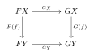{fig-alt="自然変換の自然性" width="233"}

:::

$\alpha_X$ を $\alpha$ の $X$ における*成分*という。
:::

::: definition
**定義 3.2** (自然同型). 自然変換 $\alpha \colon F \Longrightarrow G$ が*自然同型*であるとは、 すべての成分 $\alpha_X$ が $\mathcal{D}$ の同型射であることをいう。 このとき $\alpha^{-1} = (\alpha_X^{-1})_X$ も自然変換となり、$F \cong G$ と書く。
:::

::: definition
**定義 3.3** (関手圏). $\mathcal{C}$ が小圏のとき、対象を関手 $\mathcal{C}\to \mathcal{D}$、射を自然変換とし、 合成を成分ごとの合成 $(\beta \circ \alpha)_X \coloneqq\beta_X \circ \alpha_X$ で定めた圏を *関手圏*といい $[\mathcal{C},\mathcal{D}]$ あるいは $\mathcal{D}^{\mathcal{C}}$、$\mathrm{Fun}(\mathcal{C},\mathcal{D})$ と書く。 恒等射は $(\mathrm{id}_F)_X = \mathrm{id}_{FX}$。
:::

::: article-remark
**注意 3.4** (垂直合成と水平合成). 上の合成を*垂直合成*という。これとは別に、 $\alpha \colon F \Longrightarrow G$（$\mathcal{C}\to \mathcal{D}$）と $\beta \colon H \Longrightarrow K$（$\mathcal{D}\to \mathcal{E}$）に対し *水平合成* $\beta * \alpha \colon HF \Longrightarrow KG$ が

$$
(\beta * \alpha)_X \coloneqq K(\alpha_X) \circ \beta_{FX} = \beta_{GX} \circ H(\alpha_X)
$$

 で定義される（中央の等号が $\beta$ の自然性そのもの）。 特に $\beta * \mathrm{id}_F$ を $\beta F$、$\mathrm{id}_K * \alpha$ を $K\alpha$ と略記する。 これらの記法は随伴の三角等式（式([-@eq-triangle])）とモナドの公理で用いる。
:::

::: example
**例 3.5**. $V$ を有限次元ベクトル空間とすると、二重双対への写像 $\eta_V \colon V \to V^{**},\ v \mapsto (\varphi \mapsto \varphi(v))$ は $\mathrm{id}\Longrightarrow(-)^{**}$ の自然同型を与える。一方 $V \to V^{*}$ は基底の選択に依存し、自然ではない。 「自然」という語の内実が式([-@eq-naturality])であることを示す典型例である。
:::

# 普遍射 {#sec-section-4}

::: {#statement-def-universal .definition}
**定義 4.1** (普遍射). $U \colon \mathcal{D}\to \mathcal{C}$ を関手、$c \in \mathop{\mathrm{Ob}}(\mathcal{C})$ とする。 $c$ から $U$ への*普遍射*とは、対象 $r \in \mathop{\mathrm{Ob}}(\mathcal{D})$ と射 $\eta \colon c \to Ur$ の組 $(r,\eta)$ であって、 次の普遍性を満たすものをいう：

> 任意の $d \in \mathop{\mathrm{Ob}}(\mathcal{D})$ と任意の射 $f \colon c \to Ud$ に対し、 $U(g) \circ \eta = f$ を満たす射 $g \colon r \to d$ が*ただ一つ*存在する。

::: {.commutative-diagram}

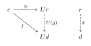{fig-alt="普遍射の一意存在" width="267"}

:::

:::

::: proposition
**命題 4.2**. 普遍射は存在すれば同型を除いて一意である。すなわち $(r,\eta)$ と $(r',\eta')$ がともに $c$ から $U$ への普遍射なら、$U(\theta)\circ\eta = \eta'$ を満たす同型 $\theta \colon r \to r'$ が一意に存在する。
:::

::: article-remark
**注意 4.3** ($\mathop{\mathrm{Hom}}$ 集合による言い換え). $(r,\eta)$ が普遍射であることは、写像

$$
\Phi_d \colon \mathcal{D}(r,d) \longrightarrow\mathcal{C}(c,Ud), \qquad g \mapsto U(g) \circ \eta
$$

 が任意の $d$ に対し全単射であることと同値である。しかもこの全単射は $d$ について自然。 これが随伴（第[7](#sec-adjoint)節）の局所版である。
:::

::: definition
**定義 4.4** (余普遍射). 双対的に、$U$ から $c$ への*余普遍射*とは $(r, \varepsilon \colon Ur \to c)$ であって、 任意の $f \colon Ud \to c$ に対し $\varepsilon \circ U(g) = f$ なる $g \colon d \to r$ が 一意に存在するもの。
:::

::: {#statement-def-representable .definition}
**定義 4.5** (表現可能関手と普遍元). 関手 $K \colon \mathcal{C}\to \mathbf{Set}$ が*表現可能*であるとは、 ある $r \in \mathop{\mathrm{Ob}}(\mathcal{C})$ と自然同型 $\psi \colon \mathcal{C}(r,-) \xrightarrow{\ \cong\ } K$ が 存在することをいう。このとき $r$ を $K$ の*表現対象*、 $u \coloneqq\psi_r(\mathrm{id}_r) \in K(r)$ を*普遍元*という。 普遍元は次の性質で特徴づけられる： 任意の $d \in \mathop{\mathrm{Ob}}(\mathcal{C})$ と $x \in K(d)$ に対し、$K(g)(u) = x$ なる $g \colon r \to d$ が一意に存在する。
:::

::: example
**例 4.6**. 自由群関手：$U \colon \mathbf{Grp}\to \mathbf{Set}$ を忘却関手、$S$ を集合とすると、 包含 $\eta \colon S \to U(F S)$（$FS$ は $S$ 上の自由群）は $S$ から $U$ への普遍射である。 「生成元の像を決めれば準同型が一意に定まる」という周知の事実が定義[4.1](#statement-def-universal)の内容そのもの。
:::

# 米田の補題 {#sec-section-5}

::: {#statement-thm-yoneda .theorem}
**定理 5.1** (米田の補題). $\mathcal{C}$ を局所小圏、$r \in \mathop{\mathrm{Ob}}(\mathcal{C})$、$K \colon \mathcal{C}\to \mathbf{Set}$ を関手とする。 このとき写像

$$
\Theta_{K,r} \colon \mathop{\mathrm{Nat}}\bigl(\mathcal{C}(r,-),\, K\bigr) \longrightarrow K(r),
  \qquad
  \alpha \longmapsto \alpha_r(\mathrm{id}_r)
$$ {#eq-yoneda}

は全単射であり、$K \in [\mathcal{C},\mathbf{Set}]$ と $r \in \mathcal{C}$ の両方について自然である。 逆写像は $x \in K(r)$ に対し

$$
\bigl(\Theta^{-1}(x)\bigr)_d \colon \mathcal{C}(r,d) \longrightarrow K(d),
  \qquad
  f \longmapsto K(f)(x)
$$

 で与えられる。
:::

::: article-proof
**証明の骨子.** $\alpha \colon \mathcal{C}(r,-) \Longrightarrow K$ と $f \colon r \to d$ に対し、自然性の四角形

::: {.commutative-diagram}

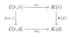{fig-alt="米田の補題の自然性" width="283"}

:::

を $\mathrm{id}_r$ に適用すると

$$
\alpha_d(f) = \alpha_d\bigl(f \circ \mathrm{id}_r\bigr) = K(f)\bigl(\alpha_r(\mathrm{id}_r)\bigr)
$$

 を得る。すなわち $\alpha$ は値 $\alpha_r(\mathrm{id}_r) \in K(r)$ ただ一つで完全に決定される。 逆に任意の $x \in K(r)$ から上式で定めた族が自然変換になることは $K$ の関手性 $K(g \circ f) = K(g) \circ K(f)$ から従う。 ◻
:::

::: article-remark
**注意 5.2**. 米田の補題は「$\mathcal{C}(r,-)$ からの自然変換全体は $K(r)$ という*集合*に過ぎない」と述べている。 また([-@eq-yoneda])は定義[4.5](#statement-def-representable)の普遍元と同じもので、 $K = \mathcal{C}(s,-)$ の場合に第[6](#sec-yoneda-embedding)節の充満忠実性が出る。
:::

::: theorem
**定理 5.3** (反変版). $K \colon \mathcal{C}^{\mathrm{op}}\to \mathbf{Set}$（前層）と $r \in \mathop{\mathrm{Ob}}(\mathcal{C})$ に対し、

$$
\mathop{\mathrm{Nat}}\bigl(\mathcal{C}(-,r),\, K\bigr) \cong K(r),
  \qquad \alpha \mapsto \alpha_r(\mathrm{id}_r)
$$

 は $r$ および $K$ について自然な全単射である。
:::

# 米田埋め込み {#sec-yoneda-embedding}

::: definition
**定義 6.1** (前層圏と米田埋め込み). $\mathcal{C}$ を小圏とする。関手圏 $\widehat{\mathcal{C}} \coloneqq[\mathcal{C}^{\mathrm{op}}, \mathbf{Set}]$ を $\mathcal{C}$ 上の*前層圏*という。 *米田埋め込み*とは関手

$$
\textbf{よ}\colon \mathcal{C}\longrightarrow\widehat{\mathcal{C}},
  \qquad
  \textbf{よ}(r) \coloneqq\mathcal{C}(-,r),
  \qquad
  \textbf{よ}(f) \coloneqq f \circ (-) \colon \mathcal{C}(-,r) \Longrightarrow\mathcal{C}(-,s)
$$

 （$f \colon r \to s$）のことである。$\textbf{よ}(r)$ を $h_r$ とも書く。
:::

::: theorem
**定理 6.2** (米田埋め込みの充満忠実性). $\textbf{よ}$ は充満忠実である。すなわち任意の $r,s \in \mathop{\mathrm{Ob}}(\mathcal{C})$ に対し

$$
\mathcal{C}(r,s) \xrightarrow{\ \cong\ } \mathop{\mathrm{Nat}}\bigl(\mathcal{C}(-,r),\, \mathcal{C}(-,s)\bigr)
$$

 は全単射である。
:::

::: article-proof
**証明.** 米田の補題（反変版）で $K = \mathcal{C}(-,s)$ とおけば $\mathop{\mathrm{Nat}}(\mathcal{C}(-,r), \mathcal{C}(-,s)) \cong\mathcal{C}(r,s)$ を得る。この全単射が $\textbf{よ}$ の射対応の逆である。 ◻
:::

::: corollary
**系 6.3** (米田原理). $\mathcal{C}$ の対象 $r,s$ について

$$
r \cong s
  \quad\Longleftrightarrow\quad
  \mathcal{C}(-,r) \cong\mathcal{C}(-,s) \ \text{（$\widehat{\mathcal{C}}$ における自然同型）}.
$$

 すなわち対象は「他のすべての対象からそこへの射の集まり」によって同型を除き決定される。
:::

::: article-remark
**注意 6.4**. $\textbf{よ}$ は一般に本質的全射ではない。$\widehat{\mathcal{C}}$ には $\textbf{よ}$ の像に入らない前層が多数あり、 $\textbf{よ}$ の像に入る前層を*表現可能前層*という。 また $\widehat{\mathcal{C}}$ は $\mathcal{C}$ の余極限による自由完備化とみなせ、 任意の前層は表現可能前層の余極限として書ける（余極限公式、稠密性定理）。
:::

# 随伴 {#sec-adjoint}

::: definition
**定義 7.1** (随伴（$\mathop{\mathrm{Hom}}$ 集合による定義）). 関手 $F \colon \mathcal{C}\to \mathcal{D}$、$G \colon \mathcal{D}\to \mathcal{C}$ が*随伴* （$F$ が左随伴、$G$ が右随伴）であるとは、全単射の族

$$
\varphi_{c,d} \colon \mathcal{D}(Fc,\, d) \xrightarrow{\ \cong\ } \mathcal{C}(c,\, Gd)
$$ {#eq-adj-hom}

であって $c \in \mathop{\mathrm{Ob}}(\mathcal{C})$、$d \in \mathop{\mathrm{Ob}}(\mathcal{D})$ の両方について自然なものが存在することをいう。 このとき $F \dashv G$ と書く。自然性とは、$k \colon c' \to c$、$h \colon d \to d'$ に対し

$$
\varphi_{c',d'}\bigl(h \circ g \circ F(k)\bigr)
  = G(h) \circ \varphi_{c,d}(g) \circ k
  \qquad \bigl(g \colon Fc \to d\bigr)
$$

 が成り立つこと。
:::

::: definition
**定義 7.2** (単位・余単位による定義). $F \dashv G$ であることは、自然変換

$$
\eta \colon \mathrm{id}_{\mathcal{C}} \Longrightarrow GF
  \quad\text{（\emph{単位}）},
  \qquad
  \varepsilon \colon FG \Longrightarrow\mathrm{id}_{\mathcal{D}}
  \quad\text{（\emph{余単位}）}
$$

 であって*三角等式*

$$
\varepsilon F \circ F\eta = \mathrm{id}_F,
  \qquad
  G\varepsilon \circ \eta G = \mathrm{id}_G
$$ {#eq-triangle}

を満たすものの存在と同値である。図式で書けば

::: {.commutative-diagram}

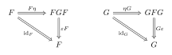{fig-alt="随伴の三角等式" width="433"}

:::

対応は $\eta_c = \varphi_{c,Fc}(\mathrm{id}_{Fc})$、$\varepsilon_d = \varphi^{-1}_{Gd,d}(\mathrm{id}_{Gd})$、 および $\varphi_{c,d}(g) = G(g) \circ \eta_c$、 $\varphi^{-1}_{c,d}(f) = \varepsilon_d \circ F(f)$ で与えられる。
:::

::: proposition
**命題 7.3** (普遍射による定義). $F \dashv G$ であることは、各 $c \in \mathop{\mathrm{Ob}}(\mathcal{C})$ に対し $(Fc,\ \eta_c \colon c \to GFc)$ が $c$ から $G$ への普遍射 （定義[4.1](#statement-def-universal)）であることと同値である。
:::

::: article-remark
**注意 7.4**. 随伴は「一意存在の言明の族」であり、([-@eq-adj-hom])の全単射が 「$Fc$ からの射を与えること」と「$Gd$ への射を与えること」の翻訳辞書になっている。 左随伴は余極限を保存し、右随伴は極限を保存する（第[9](#sec-limit)節）。
:::

::: example
**例 7.5**. 自由$\dashv$忘却：$F \colon \mathbf{Set}\to \mathbf{Grp}$、$U \colon \mathbf{Grp}\to \mathbf{Set}$ に対し $F \dashv U$。 また $(-) \times A \dashv(-)^{A}$（デカルト閉圏における冪）、 $M \otimes_R (-) \dashv\mathop{\mathrm{Hom}}_R(M,-)$（第[12](#sec-tensor)節）。
:::

# 錐 {#sec-section-8}

::: definition
**定義 8.1** (図式と対角関手). 小圏 $\mathcal{J}$（*添字圏*）から $\mathcal{C}$ への関手 $D \colon \mathcal{J}\to \mathcal{C}$ を *$\mathcal{J}$ 型の図式*という。対象 $N \in \mathop{\mathrm{Ob}}(\mathcal{C})$ に対し、 定数関手 $\Delta_N \colon \mathcal{J}\to \mathcal{C}$ を $\Delta_N(j) = N$、$\Delta_N(u) = \mathrm{id}_N$ で定める。 $N \mapsto \Delta_N$ は*対角関手* $\Delta \colon \mathcal{C}\to [\mathcal{J},\mathcal{C}]$ を与える。
:::

::: definition
**定義 8.2** (錐). 図式 $D \colon \mathcal{J}\to \mathcal{C}$ への*頂点 $N$ の錐*とは、射の族 $\psi = (\psi_j \colon N \to Dj)_{j \in \mathop{\mathrm{Ob}}(\mathcal{J})}$ であって、 $\mathcal{J}$ の任意の射 $u \colon i \to j$ に対し

$$
D(u) \circ \psi_i = \psi_j
$$ {#eq-cone}

を満たすものをいう。

::: {.commutative-diagram}

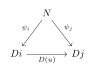{fig-alt="錐の可換条件" width="192"}

:::

同値に、錐とは自然変換 $\psi \colon \Delta_N \Longrightarrow D$ のことである （([-@eq-cone])はまさに $\Delta_N$ から $D$ への自然性条件）。
:::

::: definition
**定義 8.3** (余錐). 双対的に、$D$ からの*頂点 $N$ の余錐*とは自然変換 $\Delta_N$ への自然変換 $\phi \colon D \Longrightarrow\Delta_N$、すなわち $\phi_j \circ D(u) = \phi_i$ を満たす族 $(\phi_j \colon Dj \to N)_j$ のことである。
:::

::: definition
**定義 8.4** (錐の圏). $D$ への錐を対象とし、錐 $(N,\psi)$ から $(N',\psi')$ への射を $\psi'_j \circ h = \psi_j\ (\forall j)$ を満たす $h \colon N \to N'$ とすることで、 錐全体は圏 $\mathrm{Cone}(D)$ をなす。これはコンマ圏 $(\Delta \downarrow D)$ に他ならない （第[10](#sec-comma)節）。
:::

# 極限 {#sec-limit}

::: definition
**定義 9.1** (極限). 図式 $D \colon \mathcal{J}\to \mathcal{C}$ の*極限*とは、$D$ への錐 $(L, \varphi)$ であって 次の普遍性を満たすもの：

> $D$ への任意の錐 $(N,\psi)$ に対し、 $\varphi_j \circ u = \psi_j$（$\forall j \in \mathop{\mathrm{Ob}}(\mathcal{J})$）を満たす射 $u \colon N \to L$ が*ただ一つ*存在する。

::: {.commutative-diagram}

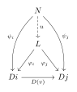{fig-alt="極限の普遍性" width="192"}

:::

$L = \varprojlim D$ と書く。すなわち極限とは $\mathrm{Cone}(D)$ の*終対象*である。
:::

::: proposition
**命題 9.2** ($\mathop{\mathrm{Hom}}$ による特徴づけ). $(L,\varphi)$ が $D$ の極限であることは、自然な全単射

$$
\mathcal{C}\bigl(N,\ \varprojlim D\bigr)
  \;\cong\;
  [\mathcal{J},\mathcal{C}]\bigl(\Delta_N,\ D\bigr)
  \qquad (\forall N \in \mathop{\mathrm{Ob}}(\mathcal{C}))
$$ {#eq-limit-hom}

が存在することと同値である。したがって（すべての $\mathcal{J}$ 型極限が存在すれば） $\varprojlim \colon [\mathcal{J},\mathcal{C}] \to \mathcal{C}$ は対角関手の右随伴 $\Delta \dashv\varprojlim$ である。 双対的に $\mathop{\mathrm{colim}}\dashv\Delta$。
:::

::: definition
**定義 9.3** (余極限). 双対的に、$D$ からの余錐のうち $\mathrm{Cocone}(D)$ の*始対象*であるものを $D$ の*余極限*といい $\varinjlim D$ と書く。
:::

::: example
**例 9.4** (添字圏による具体化).

- $\mathcal{J}$ が離散圏 $\{1,2\}$：極限は*積* $D_1 \times D_2$、余極限は*余積* $D_1 \sqcup D_2$。

- $\mathcal{J}$ が空圏：極限は*終対象*、余極限は*始対象*。

- $\mathcal{J}= (\bullet \rightrightarrows \bullet)$：極限は*等化子*、余極限は*余等化子*。

- $\mathcal{J}= (\bullet \to \bullet \leftarrow \bullet)$：極限は*引き戻し*（ファイバー積）。 双対に押し出し。

$\mathcal{C}$ が任意の小さい図式の極限をもつとき $\mathcal{C}$ は*完備*であるという。 実際、終対象と引き戻し（あるいは積と等化子）があれば有限極限はすべて構成できる。
:::

::: theorem
**定理 9.5** (右随伴は極限を保存する). $F \dashv G$ で $G \colon \mathcal{D}\to \mathcal{C}$、$D \colon \mathcal{J}\to \mathcal{D}$ の極限が存在するなら

$$
G\bigl(\varprojlim D\bigr) \cong\varprojlim (G \circ D).
$$

 双対に、左随伴は余極限を保存する。証明は([-@eq-adj-hom])と([-@eq-limit-hom])を合成するだけである。
:::

# コンマ圏 {#sec-comma}

::: definition
**定義 10.1** (コンマ圏). 関手 $S \colon \mathcal{A} \to \mathcal{C}$、$T \colon \mathcal{B} \to \mathcal{C}$ に対し、 *コンマ圏* $(S \downarrow T)$ を次で定める。

- 対象：三つ組 $(a,\, b,\, f)$、ただし $a \in \mathop{\mathrm{Ob}}(\mathcal{A})$、$b \in \mathop{\mathrm{Ob}}(\mathcal{B})$、 $f \colon Sa \to Tb$ は $\mathcal{C}$ の射。

- 射：$(a,b,f) \to (a',b',f')$ とは、$k \colon a \to a'$ と $h \colon b \to b'$ の組 $(k,h)$ であって次の図式を可換にするもの：

::: {.commutative-diagram}

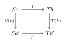{fig-alt="コンマ圏の射" width="225"}

:::

$$
\qquad\text{すなわち}\quad
  T(h) \circ f = f' \circ S(k).
$$

- 合成：$(k',h') \circ (k,h) = (k' \circ k,\ h' \circ h)$、恒等射は $(\mathrm{id}_a, \mathrm{id}_b)$。
:::

::: example
**例 10.2** (特別な場合). $\mathbf{1}$ を一点圏、$c \in \mathop{\mathrm{Ob}}(\mathcal{C})$ を関手 $\mathbf{1} \to \mathcal{C}$ とみなす。

- $(c \downarrow T)$：対象は $(b, f\colon c \to Tb)$。特に $T = \mathrm{id}_{\mathcal{C}}$ のとき $(c \downarrow \mathcal{C})$ は*余スライス圏*（$c$ の下の圏）。

- $(S \downarrow c)$：$S = \mathrm{id}_{\mathcal{C}}$ なら*スライス圏* $\mathcal{C}/c$（$c$ の上の圏）。

- $(\mathrm{id}_{\mathcal{C}} \downarrow \mathrm{id}_{\mathcal{C}})$：$\mathcal{C}$ の*射圏* $\mathcal{C}^{\to}$。

- $(\Delta \downarrow D)$：$D$ への錐の圏（第8節）。
:::

::: proposition
**命題 10.3** (普遍射・随伴の言い換え). $U \colon \mathcal{D}\to \mathcal{C}$、$c \in \mathop{\mathrm{Ob}}(\mathcal{C})$ とする。

$$
\text{$(r,\eta)$ が $c$ から $U$ への普遍射}
  \iff
  \text{$(r,\eta)$ が コンマ圏 $(c \downarrow U)$ の\emph{始対象}}.
$$

 したがって $U$ が右随伴をもつことは、すべての $c$ について $(c \downarrow U)$ が始対象をもつことと同値。
:::

# モノイド {#sec-section-11}

::: definition
**定義 11.1** (モノイド). *モノイド*とは三つ組 $(M, \mu, e)$ であって、$M$ は集合、 $\mu \colon M \times M \to M$ は写像、$e \in M$ であり、

$$
\mu(\mu(x,y),z) = \mu(x,\mu(y,z)),
  \qquad
  \mu(e,x) = x = \mu(x,e)
  \qquad (\forall x,y,z \in M)
$$

 を満たすものをいう。$\mu(x,y)$ を $x \cdot y$ と書く。 モノイド準同型 $f \colon M \to N$ は $f(x \cdot y) = f(x) \cdot f(y)$、$f(e_M) = e_N$ を満たす写像。 モノイドと準同型のなす圏を $\mathbf{Mon}$ と書く。
:::

::: article-remark
**注意 11.2** (単位元を「射」として書く). $e \in M$ は一点集合 $\mathbf{1} = \{*\}$ からの写像 $\eta \colon \mathbf{1} \to M$、$* \mapsto e$ と同一視できる。 すると公理は要素を使わずに次の可換図式で書ける（$\alpha$ は $(M \times M)\times M \cong M \times (M\times M)$）：

::: {.commutative-diagram}

{fig-alt="モノイドの結合律" width="544"}

:::

::: {.commutative-diagram}

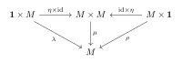{fig-alt="モノイドの単位律" width="401"}

:::

この「要素を使わない書き換え」が第[14](#sec-monoid-object)節への道を開く。
:::

::: proposition
**命題 11.3** (一対象圏としてのモノイド). モノイドは対象がただ一つの圏と同じものである。実際、 一対象圏 $\mathcal{C}$（唯一の対象 $\ast$）に対し $M \coloneqq\mathcal{C}(\ast,\ast)$、 $\mu \coloneqq\circ$、$e \coloneqq\mathrm{id}_{\ast}$ とおけばモノイドが得られ、逆も成り立つ。 この対応の下で、モノイド準同型は関手に対応する。
:::

# テンソル積 {#sec-tensor}

::: definition
**定義 12.1** (双線型写像・平衡写像). $R$ を環、$M$ を右 $R$-加群、$N$ を左 $R$-加群、$A$ をアーベル群とする。 写像 $b \colon M \times N \to A$ が*$R$-平衡双加法的*であるとは

$$
b(x+x',y) = b(x,y)+b(x',y),
  \quad
  b(x,y+y') = b(x,y)+b(x,y'),
  \quad
  b(x r, y) = b(x, r y)
$$

 がすべての $x,x' \in M$、$y,y' \in N$、$r \in R$ で成り立つことをいう。
:::

::: definition
**定義 12.2** (テンソル積（普遍性による定義）). *テンソル積*とは、アーベル群 $M \otimes_R N$ と $R$-平衡双加法的写像 $\otimes \colon M \times N \to M \otimes_R N$、$(x,y) \mapsto x \otimes y$ の組であって、 次の普遍性を満たすものである：

> 任意のアーベル群 $A$ と任意の $R$-平衡双加法的写像 $b \colon M \times N \to A$ に対し、 $\tilde{b} \circ \otimes = b$ を満たす群準同型 $\tilde{b} \colon M \otimes_R N \to A$ が *ただ一つ*存在する。

::: {.commutative-diagram}

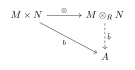{fig-alt="テンソル積の普遍性" width="271"}

:::

これは定義[4.1](#statement-def-universal)の意味の普遍射であり、$M \otimes_R N$ は同型を除いて一意に定まる。
:::

::: article-remark
**注意 12.3** (構成). 自由アーベル群 $\mathbb{Z}^{(M \times N)}$ を、生成元 $(x,y)$ に関する関係

$$
(x+x',y)-(x,y)-(x',y),
  \quad
  (x,y+y')-(x,y)-(x,y'),
  \quad
  (xr,y)-(x,ry)
$$

 で生成される部分群 $S$ で割った商 $\mathbb{Z}^{(M\times N)}/S$ が $M \otimes_R N$ を与える。 要素は一般に $\sum_i x_i \otimes y_i$ の形の*有限和*であり、 $x \otimes y$ の形の元（純テンソル）だけではないことに注意。
:::

::: proposition
**命題 12.4** (テンソル・ホム随伴). $R$ を可換環とすると、各 $M$ に対し

$$
\mathop{\mathrm{Hom}}_R\bigl(M \otimes_R N,\ A\bigr)
  \;\cong\;
  \mathop{\mathrm{Hom}}_R\bigl(N,\ \mathop{\mathrm{Hom}}_R(M, A)\bigr)
$$

 が $N,A$ について自然に成り立つ。すなわち $M \otimes_R (-) \dashv\mathop{\mathrm{Hom}}_R(M,-)$。 これによりテンソル積は余極限を保存する（右完全性）。
:::

::: article-remark
**注意 12.5**. $(\mathbf{Mod}_R, \otimes_R, R)$ はモノイダル圏（第[13](#sec-monoidal)節）の代表例であり、 $\mathbf{Set}$ における直積 $\times$ に相当する役割を果たす。
:::

# モノイダル圏 {#sec-monoidal}

::: definition
**定義 13.1** (モノイダル圏). *モノイダル圏*とは六つ組 $(\mathcal{C}, \otimes, I, \alpha, \lambda, \rho)$ である。

- $\otimes \colon \mathcal{C}\times \mathcal{C}\to \mathcal{C}$ は関手（*テンソル積*）、

- $I \in \mathop{\mathrm{Ob}}(\mathcal{C})$ は*単位対象*、

- $\alpha_{A,B,C} \colon (A \otimes B) \otimes C \xrightarrow{\cong} A \otimes (B \otimes C)$ は自然同型（*結合子*）、

- $\lambda_A \colon I \otimes A \xrightarrow{\cong} A$、 $\rho_A \colon A \otimes I \xrightarrow{\cong} A$ は自然同型（*単位子*）

であって、次の二つの整合性条件を満たす。

**五角形等式**：任意の $A,B,C,D$ について

$$
\alpha_{A,B,C \otimes D} \circ \alpha_{A \otimes B, C, D}
  =
  (\mathrm{id}_A \otimes \alpha_{B,C,D}) \circ \alpha_{A, B \otimes C, D} \circ (\alpha_{A,B,C} \otimes \mathrm{id}_D).
$$

::: {.commutative-diagram}

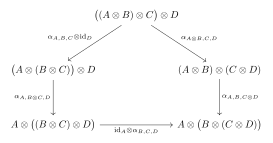{fig-alt="モノイダル圏の五角形等式" width="547"}

:::

**三角形等式**：任意の $A,B$ について

$$
(\mathrm{id}_A \otimes \lambda_B) \circ \alpha_{A,I,B} = \rho_A \otimes \mathrm{id}_B.
$$

::: {.commutative-diagram}

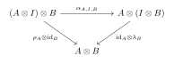{fig-alt="モノイダル圏の三角形等式" width="390"}

:::

:::

::: definition
**定義 13.2** (厳密モノイダル圏). $\alpha,\lambda,\rho$ がすべて恒等射であるモノイダル圏を*厳密*という。
:::

::: theorem
**定理 13.3** (Mac Lane の一貫性定理). 任意のモノイダル圏は厳密モノイダル圏とモノイダル同値である。 同値な言い方として、$\alpha,\lambda,\rho$ とその逆・$\otimes$ から組み立てた 「括弧の付け替え」を表す図式はすべて可換である。 したがって実用上は括弧を省略して $A_1 \otimes \cdots \otimes A_n$ と書いてよい。
:::

::: definition
**定義 13.4** (対称モノイダル圏). 自然同型 $\gamma_{A,B} \colon A \otimes B \to B \otimes A$（*組みひも*）を備え、 六角形等式を満たすものを*組みひもモノイダル圏*、 さらに $\gamma_{B,A} \circ \gamma_{A,B} = \mathrm{id}_{A \otimes B}$ を満たすものを *対称モノイダル圏*という。
:::

::: example
**例 13.5**. $(\mathbf{Set}, \times, \{*\})$、$(\mathbf{Ab}, \otimes_{\mathbb{Z}}, \mathbb{Z})$、 $(\mathbf{Mod}_R, \otimes_R, R)$、$(\mathbf{Vect}_k, \otimes_k, k)$ は対称モノイダル圏。 関手圏 $([\mathcal{C},\mathcal{C}], \circ, \mathrm{id}_{\mathcal{C}})$（合成をテンソル積とする）は厳密モノイダル圏だが、 一般に対称ではない。
:::

# モノイド対象 {#sec-monoid-object}

::: definition
**定義 14.1** (モノイド対象). $(\mathcal{C}, \otimes, I, \alpha, \lambda, \rho)$ をモノイダル圏とする。 *モノイド対象*とは三つ組 $(M, \mu, \eta)$ であって、 $M \in \mathop{\mathrm{Ob}}(\mathcal{C})$、$\mu \colon M \otimes M \to M$（*乗法*）、 $\eta \colon I \to M$（*単位*）であり、次の二つの図式が可換なものをいう。

**結合律**：

::: {.commutative-diagram}

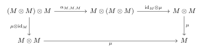{fig-alt="モノイド対象の結合律" width="591"}

:::

すなわち $\mu \circ (\mu \otimes \mathrm{id}_M) = \mu \circ (\mathrm{id}_M \otimes \mu) \circ \alpha_{M,M,M}$。

**単位律**：

::: {.commutative-diagram}

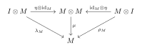{fig-alt="モノイド対象の単位律" width="399"}

:::

すなわち $\mu \circ (\eta \otimes \mathrm{id}_M) = \lambda_M$ かつ $\mu \circ (\mathrm{id}_M \otimes \eta) = \rho_M$。

モノイド対象の間の射 $f \colon (M,\mu,\eta) \to (M',\mu',\eta')$ とは、 $f \circ \mu = \mu' \circ (f \otimes f)$ かつ $f \circ \eta = \eta'$ を満たす $\mathcal{C}$ の射である。 これにより圏 $\mathbf{Mon}(\mathcal{C})$ が定まる。
:::

::: {#statement-ex-monoid-objects .example}
**例 14.2**.

- $\mathcal{C}= (\mathbf{Set},\times,\{*\})$：モノイド対象は通常のモノイド。$\mathbf{Mon}(\mathbf{Set}) = \mathbf{Mon}$。

- $\mathcal{C}= (\mathbf{Ab}, \otimes_{\mathbb{Z}}, \mathbb{Z})$：モノイド対象は*環*。

- $\mathcal{C}= (\mathbf{Mod}_R, \otimes_R, R)$（$R$ 可換）：モノイド対象は*$R$-代数*。

- $\mathcal{C}= ([\mathcal{D},\mathcal{D}], \circ, \mathrm{id}_{\mathcal{D}})$：モノイド対象は*モナド*（第[15](#sec-monad)節）。

- 対称モノイダル圏における可換モノイド対象（$\mu \circ \gamma = \mu$）は 可換モノイド・可換環に対応する。
:::

::: article-remark
**注意 14.3**. $\mathcal{C}= \mathbf{Set}$ で $\otimes = \times$、$I = \{*\}$ とすると、 $\eta \colon \{*\} \to M$ は単位元 $e$ の指定に、上の二つの図式は 第11節の結合律・単位律にそれぞれ一致する。 モノイド対象の定義は「モノイドの公理から要素への言及を完全に除去したもの」である。
:::

# モナド {#sec-monad}

::: definition
**定義 15.1** (モナド). 圏 $\mathcal{C}$ 上の*モナド*とは三つ組 $(T, \eta, \mu)$ であって、 $T \colon \mathcal{C}\to \mathcal{C}$ は関手、 $\eta \colon \mathrm{id}_{\mathcal{C}} \Longrightarrow T$（*単位*）、 $\mu \colon T^2 \Longrightarrow T$（*乗法*）は自然変換であり、 次の図式が可換なものをいう。

::: {.commutative-diagram}

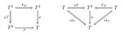{fig-alt="モナドの結合律と単位律" width="505"}

:::

すなわち

$$
\mu \circ T\mu = \mu \circ \mu T,
  \qquad
  \mu \circ \eta T = \mathrm{id}_T = \mu \circ T\eta.
$$ {#eq-monad}

成分で書けば、各 $X \in \mathop{\mathrm{Ob}}(\mathcal{C})$ について $\mu_X \circ T(\mu_X) = \mu_X \circ \mu_{TX}$、 $\mu_X \circ \eta_{TX} = \mathrm{id}_{TX} = \mu_X \circ T(\eta_X)$。
:::

::: proposition
**命題 15.2** (モナド $=$ モノイド対象). $\mathcal{C}$ 上のモナドとは、厳密モノイダル圏 $([\mathcal{C},\mathcal{C}], \circ, \mathrm{id}_{\mathcal{C}})$ における モノイド対象に他ならない。([-@eq-monad])は 第[14](#sec-monoid-object)節の結合律・単位律で $\otimes = \circ$、$I = \mathrm{id}_{\mathcal{C}}$、 $\alpha = \lambda = \rho = \mathrm{id}$ としたものである。
:::

::: theorem
**定理 15.3** (随伴はモナドを生む). $F \dashv G$、$F \colon \mathcal{C}\to \mathcal{D}$、$G \colon \mathcal{D}\to \mathcal{C}$、単位 $\eta$、余単位 $\varepsilon$ とする。 このとき

$$
T \coloneqq G F,
  \qquad
  \eta \colon \mathrm{id}_{\mathcal{C}} \Longrightarrow T,
  \qquad
  \mu \coloneqq G \varepsilon F \colon T^2 = GFGF \Longrightarrow GF = T
$$

 は $\mathcal{C}$ 上のモナドである。モナドの公理([-@eq-monad])は三角等式([-@eq-triangle])と $\varepsilon$ の自然性から従う。
:::

::: definition
**定義 15.4** (Eilenberg--Moore 代数). モナド $(T,\eta,\mu)$ に対し、*$T$-代数*とは対 $(X, h)$、 $h \colon TX \to X$ であって

$$
h \circ \eta_X = \mathrm{id}_X,
  \qquad
  h \circ T(h) = h \circ \mu_X
$$

 を満たすもの。$T$-代数と、$f \circ h = h' \circ T(f)$ を満たす射 $f$ のなす圏を $\mathcal{C}^{T}$（Eilenberg--Moore 圏）という。
:::

::: {#statement-thm-monad-from-adj .theorem}
**定理 15.5**. 逆に、任意のモナドは随伴から生じる。モナド $T$ を生成する随伴全体のなす圏 （対象は $F \dashv G$ で $GF = T$、$\eta$・$\mu$ が一致するもの）において、 Kleisli 随伴 $F_T \dashv G_T$（第[16](#sec-kleisli)節）は*始対象*、 Eilenberg--Moore 随伴 $F^T \dashv G^T$ は*終対象*である。
:::

::: example
**例 15.6**. $\mathbf{Set}$ 上の冪集合モナド $T = \mathcal{P}$、$\eta_X(x) = \{x\}$、 $\mu_X(\mathcal{A}) = \bigcup \mathcal{A}$。 また自由モノイド関手と忘却関手の随伴から生じるリストモナド $T(X) = X^{*}$、 $\eta$ は一元リスト、$\mu$ は連結。後者の $T$-代数はちょうどモノイドである。
:::

# クライスリ圏 {#sec-kleisli}

## 定義

::: {#statement-def-kleisli .definition}
**定義 16.1** (クライスリ圏). $(T,\eta,\mu)$ を圏 $\mathcal{C}$ 上のモナドとする。*クライスリ圏* $\mathcal{C}_T$ を次で定める。

- 対象：$\mathop{\mathrm{Ob}}(\mathcal{C}_T) \coloneqq\mathop{\mathrm{Ob}}(\mathcal{C})$（$\mathcal{C}$ と同じ）。

- 射：$\mathcal{C}_T(X,Y) \coloneqq\mathcal{C}(X,\, TY)$。 $\mathcal{C}_T$ の射 $X \to Y$ を、区別のため $X \rightsquigarrow Y$ と書く。

- 恒等射：$\mathrm{id}^T_X \coloneqq\eta_X \in \mathcal{C}(X,TX) = \mathcal{C}_T(X,X)$。

- 合成：$f \colon X \rightsquigarrow Y$、$g \colon Y \rightsquigarrow Z$ に対し

$$
g \odot f \coloneqq\mu_Z \circ T(g) \circ f
            \colon X \longrightarrow TY \longrightarrow T^2 Z \longrightarrow TZ.
$$ {#eq-kleisli-comp}
:::

::: proposition
**命題 16.2**. $\mathcal{C}_T$ は圏をなす。すなわち $\odot$ は結合的で $\eta$ が単位となる。
:::

::: article-proof
**証明の骨子.** 結合律はモナドの結合律 $\mu \circ T\mu = \mu \circ \mu T$ と $\mu$ の自然性から、 単位律はモナドの単位律 $\mu \circ \eta T = \mathrm{id}_T = \mu \circ T\eta$ から従う。 実際 $f \colon X \rightsquigarrow Y$ について

$$
f \odot \mathrm{id}^T_X = \mu_Y \circ T(f) \circ \eta_X
  = \mu_Y \circ \eta_{TY} \circ f = f,
  \qquad
  \mathrm{id}^T_Y \odot f = \mu_Y \circ T(\eta_Y) \circ f = f
$$

 （第一式の中央で $\eta$ の自然性 $T(f) \circ \eta_X = \eta_{TY} \circ f$ を用いた）。 ◻
:::

::: {#statement-def-kleisli-triple .definition}
**定義 16.3** (拡張演算子・クライスリトリプル). $f \colon X \to TY$ に対し、その*拡張*（extension）を

$$
f^{*} \coloneqq\mu_Y \circ T(f) \colon TX \longrightarrow TY
$$ {#eq-extension}

で定める。このとき([-@eq-kleisli-comp])は

$$
g \odot f = g^{*} \circ f
$$

 と書ける。組 $(T_0, \eta, (-)^{*})$（$T_0$ は対象への対応のみ）が次の三条件を満たすとき、 これを*クライスリトリプル*という。

$$
\begin{align}
  (\mathrm{K}1)\quad & \eta_X^{*} = \mathrm{id}_{T X}, \\
  (\mathrm{K}2)\quad & f^{*} \circ \eta_X = f
    & &(f \colon X \to TY), \\
  (\mathrm{K}3)\quad & (g^{*} \circ f)^{*} = g^{*} \circ f^{*}
    & &(f \colon X \to TY,\ g \colon Y \to TZ).
\end{align}
$$

:::

::: proposition
**命題 16.4** (モナド $=$ クライスリトリプル). モナドとクライスリトリプルは互いに一方から他方を復元でき、同じものである。 モナドから([-@eq-extension])でクライスリトリプルが得られ、逆にクライスリトリプルから

$$
T(f) \coloneqq(\eta_Y \circ f)^{*}
  \quad (f \colon X \to Y),
  \qquad
  \mu_X \coloneqq(\mathrm{id}_{TX})^{*}
$$

 とおけばモナドが得られる。
:::

::: article-remark
**注意 16.5**. クライスリトリプルの定式化では $T$ が*関手であること*を仮定しなくてよい点が実用上重要である。 $T$ の対象への対応と $\eta$、$(-)^{*}$ だけを与えれば、射への対応と関手性は $(\mathrm{K}1)$--$(\mathrm{K}3)$ から導かれる。 以降の例はすべてこの形（$T A$、$\eta_A$、$f^{*}$）で与える。
:::

::: proposition
**命題 16.6** (クライスリ随伴). 関手

$$
F_T \colon \mathcal{C}\longrightarrow\mathcal{C}_T,
  \quad X \mapsto X,
  \quad (f \colon X \to Y) \mapsto \eta_Y \circ f,
  \qquad
  G_T \colon \mathcal{C}_T \longrightarrow\mathcal{C},
  \quad X \mapsto TX,
  \quad f \mapsto f^{*}
$$

 は随伴 $F_T \dashv G_T$ をなし、単位は $\eta$、余単位は $\varepsilon_X \coloneqq\mathrm{id}_{TX} \in \mathcal{C}(TX, TX) = \mathcal{C}_T(TX, X)$ で与えられる。 さらに $G_T F_T = T$ であり、この随伴が生成するモナドはもとの $T$ に一致する。
:::

::: proposition
**命題 16.7** (Eilenberg--Moore 圏への埋め込み). 比較関手

$$
K \colon \mathcal{C}_T \longrightarrow\mathcal{C}^{T},
  \qquad
  X \mapsto (TX,\ \mu_X),
  \qquad
  (f \colon X \rightsquigarrow Y) \mapsto f^{*}
$$

 は充満忠実であり、その像は*自由 $T$-代数*のなす $\mathcal{C}^{T}$ の充満部分圏である。 すなわち $\mathcal{C}_T$ は「自由代数だけを集めた圏」とみなせる （定理[15.5](#statement-thm-monad-from-adj)の始対象性はこれに対応する）。
:::

## 計算概念としての読み方

::: article-remark
**注意 16.8** (計算効果のモデル). $\mathcal{C}= \mathbf{Set}$ とし、$T$ を「計算効果」を表す構成とみなす。このとき

$$
\mathcal{C}_T(A,B) = \mathcal{C}(A,\, TB)
$$

 は「$A$ を入力として受け取り、効果 $T$ を伴って $B$ を返す計算」の集合と読める。 通常の写像 $A \to B$ が*値*の対応であるのに対し、 クライスリ射 $A \rightsquigarrow B$ は*計算*の対応である。 この読み替えの下で

$$
\eta_A = \texttt{return},
  \qquad
  f^{*} = \texttt{bind}\ (\texttt{>>=}),
  \qquad
  \odot = \text{クライスリ合成}\ (\texttt{>=>})
$$

 であり、クライスリトリプルの公理はモナド則そのものになる：

$$
\underbrace{\texttt{return}\ a \mathbin{\texttt{>>=}} f = f\,a}_{(\mathrm{K}2)},
  \quad
  \underbrace{m \mathbin{\texttt{>>=}} \texttt{return} = m}_{(\mathrm{K}1)},
  \quad
  \underbrace{(m \mathbin{\texttt{>>=}} f) \mathbin{\texttt{>>=}} g
   = m \mathbin{\texttt{>>=}} (\lambda a.\, f\,a \mathbin{\texttt{>>=}} g)}_{(\mathrm{K}3)}.
$$

 効果を伴う計算の*逐次合成*が結合的で単位をもつ、という主張が 「$\mathcal{C}_T$ が圏である」という命題の内容である。
:::

## クライスリ圏をなす計算概念の例

以下、$\mathcal{C}= \mathbf{Set}$ とし、各例をクライスリトリプル $(T,\eta,(-)^{*})$ の形で与える （$f \colon A \to TB$、$c \in TA$）。

::: example
**例 16.9** (部分性（partiality）).

$$
\begin{align}
  T A &= A_{\bot} \coloneqq A + \{\bot\}, \\
  \eta_A &\colon A \hookrightarrow A_{\bot}
    \quad\text{（包含写像）}, \\
  f^{*}(\bot) &= \bot,
  \qquad
  f^{*}(a) = f(a) \quad (a \in A).
\end{align}
$$

 $\bot$ は「停止しない／値をもたない」を表す。 $\mathcal{C}_T(A,B) = (B_{\bot})^{A}$ は $A$ から $B$ への部分写像全体と同一視でき、 $\mathbf{Set}_T \cong\mathbf{Par}$（集合と部分写像の圏）となる。 $f^{*}(\bot) = \bot$ は「未定義な入力に対しては何も計算しない」という*正格性*の要求である。
:::

::: example
**例 16.10** (非決定性（nondeterminism）).

$$
\begin{align}
  T A &= \mathcal{P}_{\mathrm{fin}}(A) \quad\text{（有限部分集合全体）}, \\
  \eta_A &\colon a \longmapsto \{a\}
    \quad\text{（単元集合写像）}, \\
  f^{*}(c) &= \bigcup_{x \in c} f(x)
    \qquad (c \in TA).
\end{align}
$$

 「起こりうる結果の集合」を返す計算。$\eta$ は決定的な計算（可能な結果がただ一つ）に対応し、 $f^{*}$ は各可能性について $f$ を走らせて結果を合併する。 $\mathcal{C}_T(A,B) = \mathcal{P}_{\mathrm{fin}}(B)^{A}$ は $A$ から $B$ への（各点の像が有限な）関係と同一視され、 クライスリ合成([-@eq-kleisli-comp])は関係の合成 $R \circ S$ に一致する。 $\mathcal{P}_{\mathrm{fin}}$ を全冪集合モナド $\mathcal{P}$ に取り替えれば $\mathbf{Set}_{\mathcal{P}}$ は関係の圏 $\mathbf{Rel}$ そのものになる （有限版はその充満とは限らない部分圏）。
:::

::: example
**例 16.11** (副作用（side-effects）). 状態の集合 $S$ を固定する。

$$
\begin{align}
  T A &= (A \times S)^{S}, \\
  \eta_A &\colon a \longmapsto \bigl(\lambda s \colon S.\ \langle a, s\rangle\bigr), \\
  f^{*}(c) &= \lambda s \colon S.\ \bigl(\mathbf{let}\ \langle a,s'\rangle = c(s)\ \mathbf{in}\ f(a)(s')\bigr).
\end{align}
$$

 計算とは「状態を受け取り、値と*更新された*状態を返す」もの。 $\eta$ は状態を変えずに値を返す計算であり、 $f^{*}$ は $c$ の出力状態 $s'$ を $f(a)$ の入力状態として渡す、すなわち 状態の*引き回し*を合成の側に押し込んでいる。 なお $T = (- \times S)^{S}$ は随伴 $(- \times S) \dashv(-)^{S}$ から生じるモナドである。
:::

::: example
**例 16.12** (例外（exceptions）). 例外の集合 $E$ を固定する。

$$
\begin{align}
  T A &= A + E, \\
  \eta_A &\colon a \longmapsto \mathrm{inl}(a)
    \quad\text{（入射写像）}, \\
  f^{*}\bigl(\mathrm{inr}(e)\bigr) &= \mathrm{inr}(e) \quad (e \in E),
  \qquad
  f^{*}\bigl(\mathrm{inl}(a)\bigr) = f(a) \quad (a \in A).
\end{align}
$$

 $\mathrm{inl}$ は正常終了、$\mathrm{inr}$ は例外送出を表す。 $f^{*}$ の第一式が「一度例外が起きたら以降の計算を飛ばして例外を伝播する」という短絡挙動である。
:::

::: article-remark
**注意 16.13** (例外の場合の型について). 文献によっては例外の項を $f^{*}(\mathrm{inr}(e)) = e$ と略記することがあるが、 $f^{*} \colon TA \to TB = B + E$ である以上、右辺は $TB$ の元でなければならない。 したがって正しくは $\mathrm{inr}(e) \in B + E$ であり、上式のように $\mathrm{inr}$ を明示するのが安全である （$E$ 成分上では $f^{*}$ が恒等的に働く、というのが主張の内容）。
:::

::: example
**例 16.14** (継続（continuations）). 結果型 $R$ を固定する。

$$
\begin{align}
  T A &= R^{(R^{A})}, \\
  \eta_A &\colon a \longmapsto \bigl(\lambda k \colon R^{A}.\ k(a)\bigr), \\
  f^{*}(c) &= \bigl(\lambda k \colon R^{B}.\ c\bigl(\lambda a \colon A.\ f(a)(k)\bigr)\bigr).
\end{align}
$$

 型を追うと、$c \in R^{(R^{A})}$、$k \in R^{B}$ に対し $\lambda a.\, f(a)(k) \in R^{A}$ となるので $c(\lambda a.\, f(a)(k)) \in R$、 よって $f^{*}(c) \in R^{(R^{B})} = TB$ で整合する。 $k$ は「この計算の後に何をするか」を表す*継続*であり、 $\eta$ は「値 $a$ をそのまま継続に渡す」、 $f^{*}$ は「$f$ の実行と後続の $k$ を合成した新しい継続を $c$ に渡す」と読める。 このモナドは自己随伴 $R^{(-)} \dashv R^{(-)}$（$\mathbf{Set}^{\mathrm{op}}$ 側との随伴）から生じる。
:::

:::: article-remark
**注意 16.15** (まとめ).

::: center
  計算概念   $TA$                              $\eta_A(a)$                      $f^{*}$ の要点
  ---------- --------------------------------- -------------------------------- --------------------------
  部分性     $A + \{\bot\}$                    $a$                              $\bot$ を保存
  非決定性   $\mathcal{P}_{\mathrm{fin}}(A)$   $\{a\}$                          各要素の像の合併
  副作用     $(A \times S)^{S}$                $\lambda s.\langle a,s\rangle$   状態の受け渡し
  例外       $A + E$                           $\mathrm{inl}(a)$                $E$ 成分では恒等（伝播）
  継続       $R^{(R^{A})}$                     $\lambda k.\,k(a)$               継続の合成
:::

いずれの場合も「効果つき計算の合成」がクライスリ合成([-@eq-kleisli-comp])として統一的に記述され、 効果ごとの違いは $T$、$\eta$、$(-)^{*}$ の三つ組だけに局在する。 これが Moggi による計算のモナド的意味論の出発点である。
::::

# 関係のまとめ {#sec-section-17}

- 普遍射 $=$ コンマ圏 $(c \downarrow U)$ の始対象 $=$ 表現可能関手の普遍元。

- 随伴 $F \dashv G$ $=$ 各 $c$ について $(Fc,\eta_c)$ が普遍射 $=$ 自然な全単射 $\mathcal{D}(Fc,d) \cong\mathcal{C}(c,Gd)$。

- 極限 $=$ 錐の圏（$= (\Delta \downarrow D)$）の終対象 $=$ 対角関手 $\Delta$ の右随伴。

- 米田の補題 $\Rightarrow$ 米田埋め込みの充満忠実性 $\Rightarrow$ 「対象は表現する関手で決まる」。

- モノイド $=$ $(\mathbf{Set},\times)$ のモノイド対象、 環 $=$ $(\mathbf{Ab},\otimes)$ のモノイド対象、 モナド $=$ $([\mathcal{C},\mathcal{C}],\circ)$ のモノイド対象。

- 随伴 $\Rightarrow$ モナド $\Rightarrow$（Kleisli / Eilenberg--Moore により）再び随伴。 前者は $T$ を生成する随伴の圏の始対象、後者は終対象。

- クライスリ圏 $\mathcal{C}_T$ $=$ 自由 $T$-代数のなす $\mathcal{C}^{T}$ の充満部分圏 $=$「効果 $T$ を伴う計算」の圏。$\eta = \texttt{return}$、$(-)^{*} = \texttt{bind}$。
